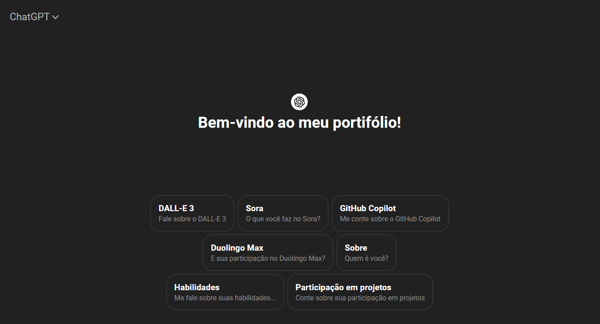

## Portfólio Pessoal da OpenAI

<a href="https://portfolio-open-ai.surge.sh/">
    
</a>

#

O Portfólio Pessoal da OpenAI foi desenvolvido durante a disciplina de Desenvolvimento Web I do curso de Bacharelado em Sistemas de Informação, com colaboração de Gabriel L. Pereira, Gustavo H. B. Velho e Maria E. N. Ferreira.
Ele apresenta de forma interativa as capacidades do GPT-4, a inteligência artificial da OpenAI, como se fosse uma entidade com seu próprio portfólio de realizações. Desenvolvido com VueJS, o portfólio destaca os usos do GPT.

Deploy: https://portfolio-open-ai.surge.sh/

## Instalação

1. Clone este repositório:
    ```bash
    git clone https://github.com/gabriel04alves/portfolio-open-ai-vuejs
    ```
   
2. Navegue até o diretório do projeto:
    ```bash
    cd chatgpt-portfolio
    ```

3. Instale as dependências:
    ```bash
    npm install
    ```

4. Inicie o servidor de desenvolvimento:
    ```bash
    npm run dev
    ```

5. Acesse o projeto no navegador:
    ```
    http://localhost:3000
    ```

## Estrutura de Pastas

```bash
├── public/                # Arquivos públicos (imagens, ícones)
├── src/
│   ├── assets/            # Recursos de mídia
│   ├── components/        # Componentes Vue reutilizáveis
│   ├── services/          # Lógica para chamadas à API
│   ├── views/             # Páginas principais da aplicação
│   ├── router/            # Configuração de rotas
│   └── App.vue            # Componente raiz
├── .gitignore             # Arquivos e diretórios ignorados pelo Git
├── package.json           # Dependências e scripts do projeto
└── README.md              # Documentação do projeto